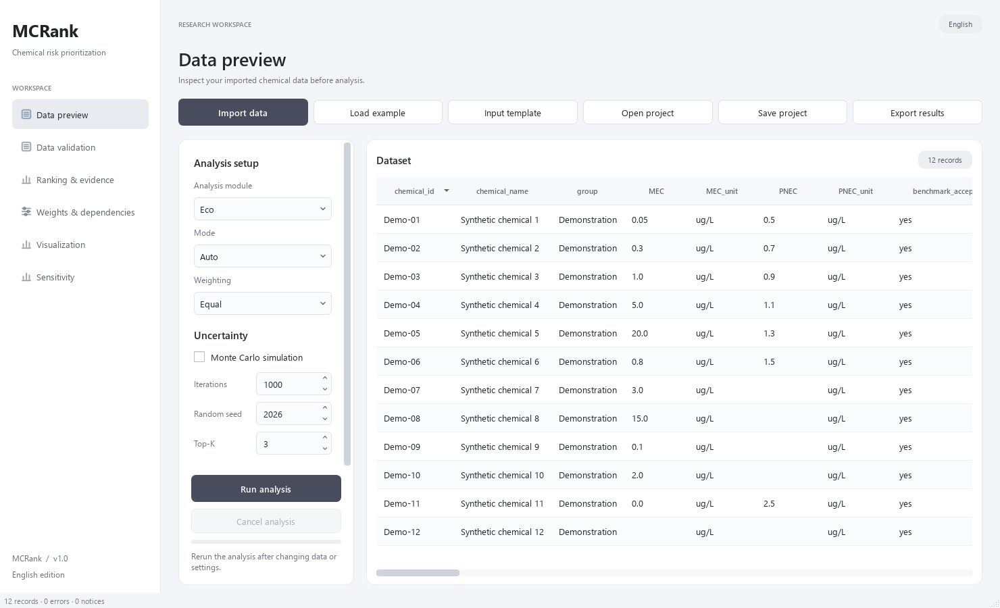
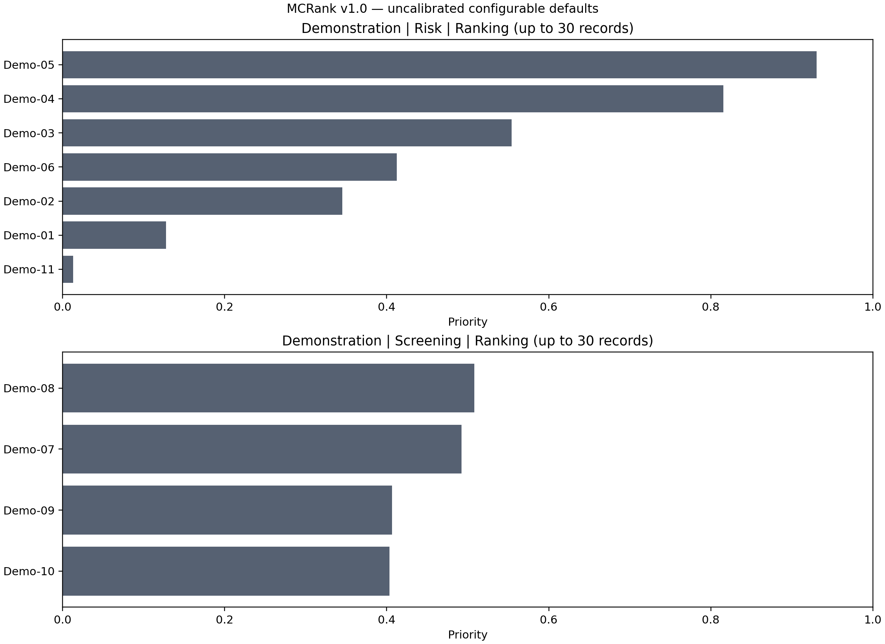
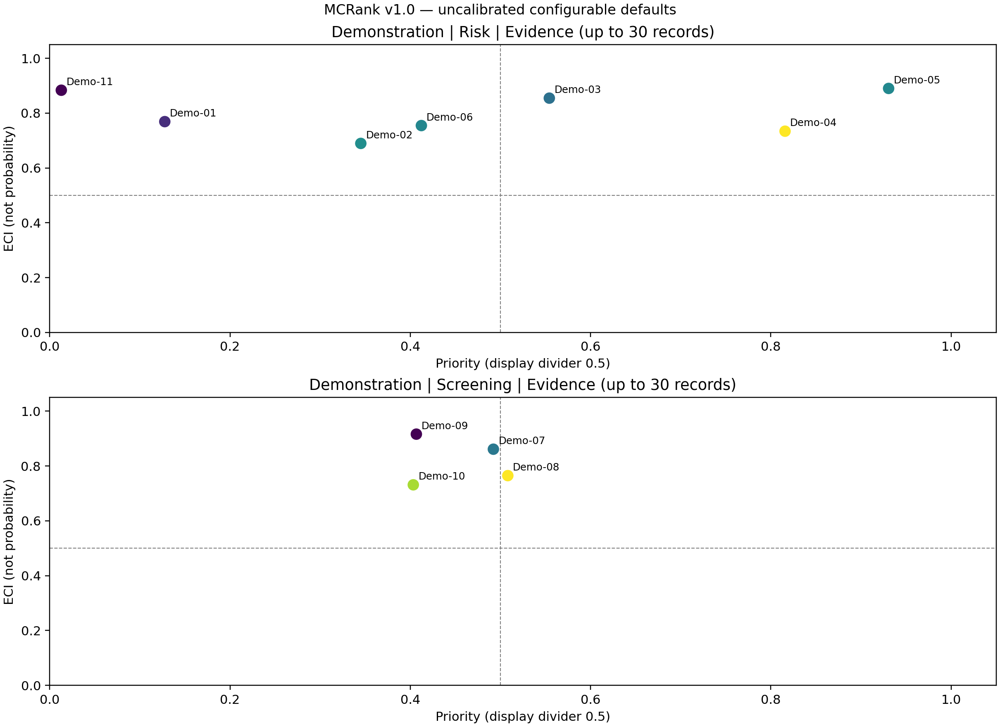
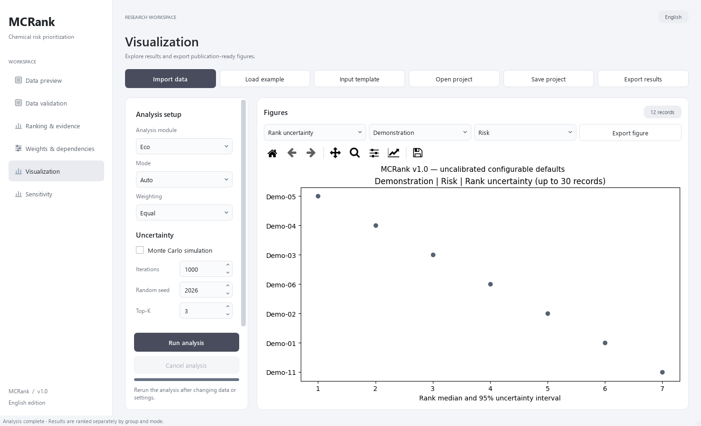

<div align="center">

## MCRank

#### Multidimensional Chemical Risk Prioritization

**Ecological and human-health analysis · Evidence assessment · Monte Carlo rank robustness**


[Overview](#overview) · [Quick start](#quick-start) · [Methods](#analysis-framework) · [Data](#input-data) · [Outputs](#outputs-and-figures) · [Citation](#citation)

</div>



*The MCRank v1.0 desktop interface. The displayed records are synthetic examples, not measured chemical data.*

### Overview

MCRank is a Python desktop application for prioritizing chemicals using exposure, hazard or risk benchmarks, environmental fate or toxicokinetics, and evidence metadata. It provides separate **ecological** and **human-health** workflows, each supporting **Risk**, **Screening**, and automatic mode selection.

The software brings data validation, priority ranking, evidence assessment, Monte Carlo analysis, and export into one English-language workspace. Priority, evidence, and rank robustness are reported separately so that the basis for each result remains visible.

> **Scientific status.** Version 1.0 uses explicit, configurable defaults that have not been scientifically calibrated. The examples are synthetic. Software tests and reproducible execution do not establish predictive validity on real datasets. See [Methods and assumptions](docs/METHODS.md) before interpreting results.

#### Capabilities

| Component | Implemented functionality |
|---|---|
| Analysis | Eco/Human Risk and Screening; Auto mode; separate rankings by comparison group and mode |
| Data | CSV/XLSX import, worksheet selection, preview, input templates, unit checks, and validation |
| Weighting | Equal, CRITIC, and Custom weights; renormalization over available inputs |
| Missing data | Missing values remain distinct from observed zeros; insufficient core inputs are flagged |
| Dependencies | Defined indicator dependency controls to prevent duplicate contributions |
| Evidence | Evidence Confidence Index (ECI), component completeness, and evidence metadata coverage |
| Data acquisition | Data Acquisition Priority (DAP), reported separately from the priority score |
| Robustness | Monte Carlo score/rank intervals, Top-K inclusion probabilities, and rank robustness metrics |
| Sensitivity | Marginal parameter–score Spearman associations |
| Reproducibility | Project save/open, configurable seed, exported settings, and normalized-input hash |
| Export | CSV, XLSX, PNG, JSON, and simulation arrays; individual figures in PNG/PDF/SVG |

### Analysis framework


*Conceptual workflow. Forced Risk or Screening requires eligible inputs and never silently switches to another mode. Risk and Screening scores are not pooled into one ranking.*

#### Four analysis pathways

| Module and mode | Core information | Additional information |
|---|---|---|
| **Eco_Risk** | Environmental concentration / accepted PNEC | Occurrence, persistence, and bioaccumulation |
| **Eco_Screening** | Exposure and accepted ecological hazard information | Persistence and bioaccumulation |
| **Human_Risk** | Biomonitoring concentration / accepted, compatible HB2GV | Occurrence and toxicokinetics |
| **Human_Screening** | Exposure and a reviewed human hazard score | Toxicokinetics |

For Human Risk, sample and benchmark **matrix** and **basis** must match and be nonempty. Eco Screening prioritizes accepted chronic hazard information over acute information. These choices are explicit in the implementation and [data dictionary](docs/DATA_DICTIONARY.md).

#### Scores and their interpretation

- **Priority:** the implemented risk- or screening-based prioritization score on a 0–1 scale. The output identifies the mode and score type.
- **ECI:** a geometric aggregation of available evidence components. It is **not a probability**; completeness-only ECI does not demonstrate evidence reliability.
- **DAP:** `Priority × (1 − ECI)`, a supplementary index for data-acquisition prioritization.
- **Rank intervals and Top-K:** summaries of repeated rankings under the specified uncertainty assumptions. Top-K ties can include more than K chemicals.

ECI, DAP, and rank robustness do not feed back into Priority. Optional missing inputs use available-weight renormalization; mandatory missing core information produces an **Insufficient** result.

### Quick start

#### Windows desktop application

When a packaged version is available, download **MCRank-v1.0.0-Windows-x64.zip** from this repository's **Releases** section.

1. Extract the complete archive.
2. Keep `MCRank.exe` and `_internal/` in the same folder.
3. Double-click `MCRank.exe`.
4. Select **Load example**, then **Run analysis**.
5. Enable **Monte Carlo simulation** and rerun to explore rank robustness.

The packaged application requires no separate Python installation. Do not move the executable without its accompanying `_internal` folder. The Windows executable is not included in the source tree; GitHub's automatically generated source archives are not the desktop application.

#### Run from source

The delivered build was prepared on Windows with **64-bit Python 3.14.3**. Exact top-level dependency versions are recorded in [requirements-tested.txt](requirements-tested.txt). Other Python/OS combinations have not been validated by this release.

From the repository root:

```powershell
python -m venv .venv
.venv\Scripts\python.exe -m pip install -r requirements-tested.txt
.venv\Scripts\python.exe run.py
```

Alternatively, `start_windows.bat` creates a local environment and installs the compatible version ranges in `requirements.txt` on first use. Installing source dependencies requires network access.

#### Command-line analysis

```powershell
# Ecological analysis with automatic mode selection and Monte Carlo
.venv\Scripts\python.exe -m mcrank --input examples/chemicals.csv --output results/eco --module Eco --mode Auto --weighting Equal --mc

# Human-health analysis
.venv\Scripts\python.exe -m mcrank --input examples/chemicals.xlsx --output results/human --module Human --mode Auto

# A full configuration with explicit uncertainty settings
.venv\Scripts\python.exe -m mcrank --input examples/chemicals.csv --output results/configured --module Eco --config config/example_uncertainty.json --mc
```

The CLI reads the first XLSX worksheet; the GUI lets the user select a worksheet. Use `python -m mcrank --help` for arguments. The packaged `MCRank.exe` is the desktop launcher; these batch commands use the source installation.

### Desktop workflow

| Page | Purpose |
|---|---|
| **Data preview** | Inspect imported chemical records |
| **Data validation** | Review errors and notices |
| **Ranking & evidence** | Examine priority scores, ranks, evidence, and robustness outputs |
| **Weights & dependencies** | Review indicator weights; inspect the IDC column in ranking results for dependency paths |
| **Visualization** | Select a chart, comparison group, and mode; export figures |
| **Sensitivity** | Inspect parameter–score associations after Monte Carlo analysis |

Use the analysis card to select **Eco/Human**, **Auto/Risk/Screening**, and **Equal/CRITIC/Custom**, then set iterations, seed, and Top-K as needed. **Save project** stores data and configuration; **Open project** restores them. Recalculate after changing settings or loading a project.

The desktop edition has six pages. Advanced configuration and run-log editors are not exposed as separate pages. For custom weights or data-error models, edit a full configuration JSON and use CLI `--config`, or load a project containing those settings. Selecting Custom alone uses the weights currently stored in the configuration. Exported `run_metadata.json` contains the run settings and assumptions.

### Input data

Start with the bundled [CSV template](examples/input_template.csv) or [Excel template](examples/input_template.xlsx). The [CSV demonstration dataset](examples/chemicals.csv) and [Excel demonstration dataset](examples/chemicals.xlsx) contain **12 synthetic records**.

| Input family | Examples |
|---|---|
| Identity and grouping | `chemical_id`, `chemical_name`, `group` |
| Ecological concentration and benchmark | `MEC`, `MEC_unit`, `PNEC`, `PNEC_unit` |
| Human concentration and benchmark | `Cbio`, `Cbio_unit`, `HB2GV`, `HB2GV_unit`, matrix and basis fields |
| Occurrence | `DF`, `SO`, `TO`, `PREV` |
| Fate and toxicokinetics | `half_life_days`, `BCF`, `TK`, `human_half_life_days` |
| Screening hazard | `chronic`, `acute`, associated units, `human_hazard` |
| Evidence | `<domain>_quality`, `<domain>_n`, `<domain>_consistency` |

Important input conventions:

- Headers are case-sensitive; identifiers must be unique within a comparison group.
- Blank, NA, and N/A denote missing values. Observed zeros are retained.
- Concentrations are converted to ug/L. Supported units include ng/L, ug/L, µg/L, mg/L, and ng/mL.
- `benchmark_accepted=yes` and `hazard_accepted=yes` record explicit acceptance of the corresponding inputs.
- Censored observations such as `<LOD` require a study-specific treatment before import; the software does not automatically substitute LOD/2.
- Creatinine-adjusted and lipid-adjusted concentrations are not automatically converted.

See the [complete input dictionary](docs/DATA_DICTIONARY.md) for field definitions and acceptance rules.

### Outputs and figures



*Example priority rankings from the synthetic dataset. Separate panels preserve the distinction between Risk and Screening.*



*Priority and ECI are displayed on separate axes. Color represents DAP. The 0.5 divider lines are display references, not validated decision thresholds.*



*Actual release self-test output, using 30 iterations solely for a short software demonstration. This run does not establish Monte Carlo convergence. See [figure provenance](docs/FIGURES.md).*

#### Exported files

| File | Contents |
|---|---|
| `results.csv`, `results.xlsx` | Priority scores, component values, ranks, ECI/DAP, and available robustness outputs |
| `weights.csv` | Indicator/domain weights |
| `normalized_input.csv` | Inputs after unit normalization |
| `run_metadata.json` | Configuration, assumptions, ranking rules, and normalized-input SHA-256 |
| `Ranking.png`, `Evidence.png`, `Profile_heatmap.png`, `Rank_uncertainty.png`, `Top-K.png`, `DAP.png` | Six plot types; MC-dependent plots require a Monte Carlo run |
| `monte_carlo_draws.npz` | Simulated scores and ranks, when Monte Carlo is enabled |
| `sensitivity.csv` | Marginal parameter–score associations, when Monte Carlo is enabled |

Individual figures can also be saved as **PNG, PDF, or SVG** from Visualization. Use a new export folder for each run: same-named files are overwritten.

### Reproducibility and limitations

Record the software version, dataset, configuration, iteration count, seed, and comparison groups for each analysis. Preserve the exported metadata alongside the results.

- Risk and Screening are ranked separately, using competition ranks for ties.
- ECI summarizes supplied evidence; the application does not independently assess source studies.
- Data uncertainty is sampled only when explicitly configured. Without such settings, the input measurements are held fixed while configured weights/method parameters vary.
- The implemented uncertainty model assumes independent data draws across fields and chemicals, with shared parameter/weight draws.
- Reported intervals are **uncertainty intervals**, not confidence intervals.
- Sensitivity outputs are associations, not causal attribution or Sobol indices.
- Calibration and validation on appropriate real datasets remain necessary for scientific interpretation.

Details: [Methods](docs/METHODS.md) · [Software validation](docs/VALIDATION.md) · [Example figure provenance](docs/FIGURES.md).

### Tests and packaging

```powershell
.venv\Scripts\python.exe -m pip install -r requirements-dev.txt
.venv\Scripts\python.exe -m pytest tests -q
.venv\Scripts\python.exe -m PyInstaller MCRank.spec --noconfirm
```

PyInstaller produces `dist/MCRank/MCRank.exe` and its accompanying dependency directory. Distribute the **entire folder** as a release archive. The build configuration includes examples, documentation, configuration files, and UI assets.

Software checks performed during development and release verification are described in [VALIDATION.md](docs/VALIDATION.md). No cross-platform validation claim is made.

### Citation

If MCRank contributes to your work, cite the software version and repository, and retain the exact release tag or commit used:

> Eamon-Yang. MCRank: Multidimensional Chemical Risk Prioritization. Version 1.0.0. https://github.com/Eamon-Yang/MCRank.
